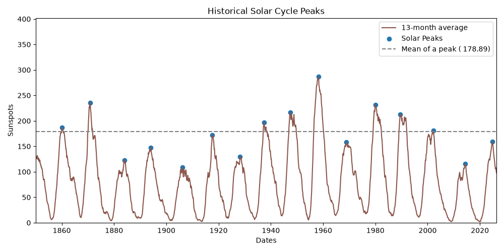
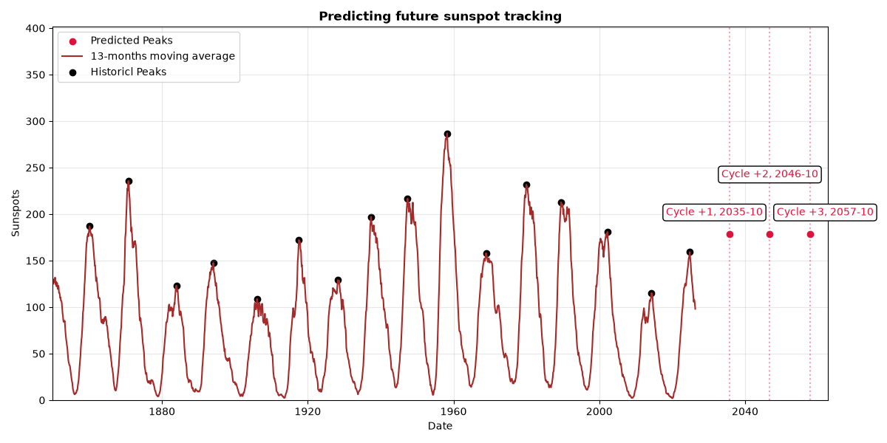

# How can the next solar cycle be predicted? 

## Table of contents
1. [Introduction](#introduction)
2. [Features](#features)
3. [Installation](#installation)
4. [Usage](#usage)
5. [Data Interpretation](#data-interpretation)
6. [Contact](#contact)

## Introduction
In this project, a data set was downloaded from Kaggle.com to analyze and track sunspots.
The output graphs serve as a visualization tool for better understanding and depiction of the raw data.
The code contains docstrings revealing reasoning behind the used lines as this was built as a course project. 

## Features
**Data Loading and Cleaning**: The data set is downloaded from Kaggle and missing data rows are dropped\
**Data processing**: Grouping data into monthly averages and smoothing it by implementing the 13-month centered average\
**Peak Detection**: The peaks were dected with find_peaks function imported from scipy.signal\
**Statistics**: Average values of peaks and standard deviation were calculated and minimum and maximum peak values were detected\
**Predicting future cycles**: Next three cycles were predicted, a year and a month are included in the output\
**Visualization**: Both peak detection and future cycles were plotted using matplotlib.pyplot, containing legends, titles and axis for clear understanding\

## Installation
### prerequsites 
- python 3.13 or higher
- required libraries: 
    - pandas
    - numpy
    - matplotlib
    - scipy

1. clone the repository
```
git clone https://github.com/eliskazsilleova/Solar-tracking.git
cd Solar-Tracking
```
2. Install dependencies
```
pip install pandas numpy matplotlib scipy
```
## Usage
```bash
main-code.py
```

## Data Interpretation
- Samples: 64404 dates were used in solar tracking
- Outcome: 16 solar peaks were detected 
- Averages and standard deviations: 
    - average length of a solar cycle is 10.98 years with a standard deviation of ±1.10 years
    - average amplitude of a peak is 178.89 sunspots with a standard deviation of ±49.11 sunspots


- Predictions: 3 peaks of future cycles were predicted 
    -  1.peak: 2035-10
    -  2.peak: 2046-10
    -  3.peak: 2057-10


## Contact 
To report bugs, provide feedback or ask any questions contact me through a university email e.zsilleova@student.maastrichtuniversity.nl

Last updated: October 2026
